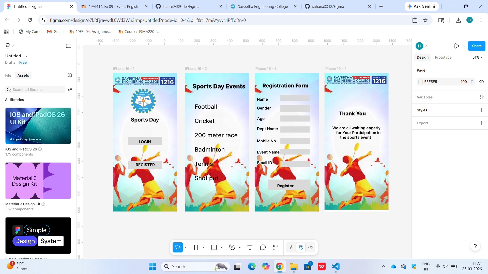

# Ex08 Event Registration Web Application
## Date:24.03.2026

## AIM:
To design, develop and deploy a web application for event registration using Figma UI tool.

## UI DESIGN TOOL:
Figma

## DESIGN STEPS:

### Step 1:
Use frames to represent screens or sections.

### Step 2:
Add column grids for consistent spacing and alignment.

### Step 3:
Insert shapes, text, buttons, and icons.

### Step 4:
Use Auto Layout for flexible, responsive design.

### Step 5:
Define color, text, and effect styles globally for consistency.

### Step 6:
Name layers logically and group related elements.

### Step 6:
Link frames to show navigation or interactions.

### Step 7:
Select the specific frame while generating code using Anima plugin.

## CODE:
```
<!DOCTYPE html>
<html>
  <head>
    <meta name="viewport" content="width=device-width, initial-scale=1" />
    <meta charset="utf-8" />
    <link rel="stylesheet" href="globals.css" />
    <link rel="stylesheet" href="style.css" />
  </head>
  <body>
    <div class="iphone">
      
      
      
      <p class="sports-day"><span class="text-wrapper">&nbsp;&nbsp; </span> <span class="span">Sports Day</span></p>
      <div class="div"></div>
      <p class="LOGIN"><span class="text-wrapper-2">L</span> <span class="text-wrapper-3">OGIN</span></p>
      <div class="rectangle-2"></div>
      <div class="text-wrapper-4">REGISTER</div>
    </div>
  </body>
</html>


<!DOCTYPE html>
<html>
  <head>
    <meta name="viewport" content="width=device-width, initial-scale=1" />
    <meta charset="utf-8" />
    <link rel="stylesheet" href="globals.css" />
    <link rel="stylesheet" href="style.css" />
  </head>
  <body>
    <div class="iphone">
      
      <div class="text-wrapper">Sports Day Events</div>
      <div class="football-cricket">
        Football<br /><br />Cricket<br /><br />200 meter race<br /><br />Badminton<br /><br />Tennis<br /><br />Shot put
      </div>
    </div>
  </body>
</html>

<!DOCTYPE html>
<html>
  <head>
    <meta name="viewport" content="width=device-width, initial-scale=1" />
    <meta charset="utf-8" />
    <link rel="stylesheet" href="globals.css" />
    <link rel="stylesheet" href="style.css" />
  </head>
  <body>
    <div class="iphone">
      
      <div class="text-wrapper">Dept Name</div>
      <div class="div">Gender</div>
      <div class="text-wrapper-2">Name</div>
      <div class="text-wrapper-3">Registration Form</div>
      <div class="text-wrapper-4">Age</div>
      <div class="text-wrapper-5">Mobile No</div>
      <div class="text-wrapper-6">Event Name</div>
      <div class="text-wrapper-7">Email ID</div>
      <div class="rectangle-2"></div>
      <div class="rectangle-3"></div>
      <div class="rectangle-4"></div>
      <div class="rectangle-5"></div>
      <div class="rectangle-6"></div>
      <div class="rectangle-7"></div>
      <div class="rectangle-8"></div>
      <div class="rectangle-9"></div>
      <div class="text-wrapper-8">Register</div>
    </div>
  </body>
</html>

<!DOCTYPE html>
<html>
  <head>
    <meta name="viewport" content="width=device-width, initial-scale=1" />
    <meta charset="utf-8" />
    <link rel="stylesheet" href="globals.css" />
    <link rel="stylesheet" href="style.css" />
  </head>
  <body>
    <div class="image"></div>
  </body>
</html>


```
## OUTPUT:


## RESULT:
The program to design, develop and deploy a web application for event registration using Figma UI tool is completed successfully.
